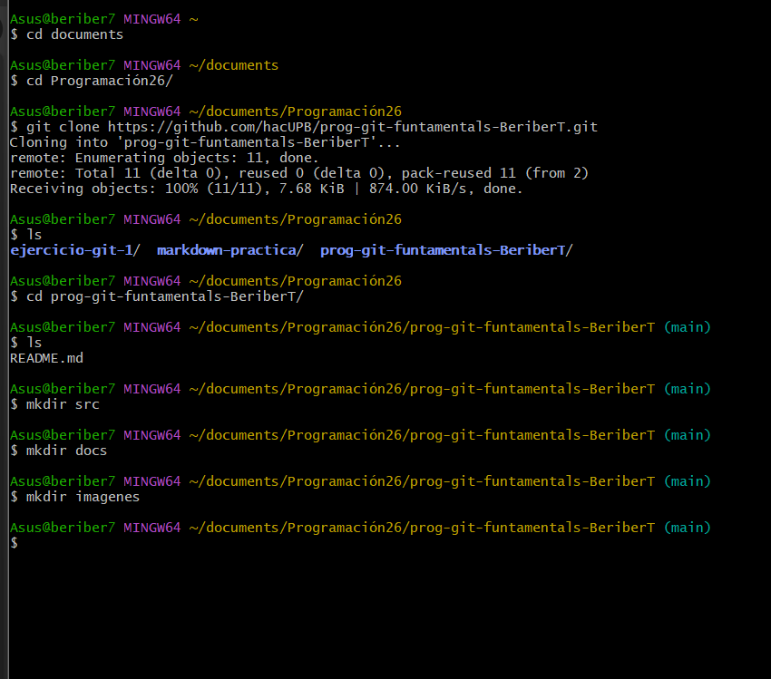
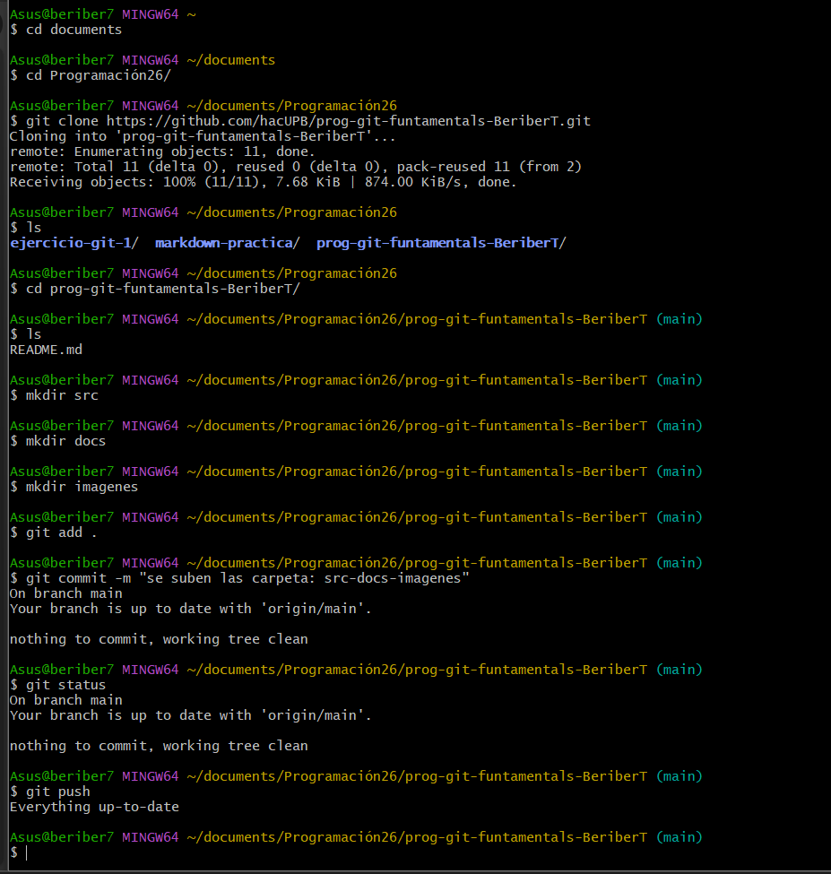
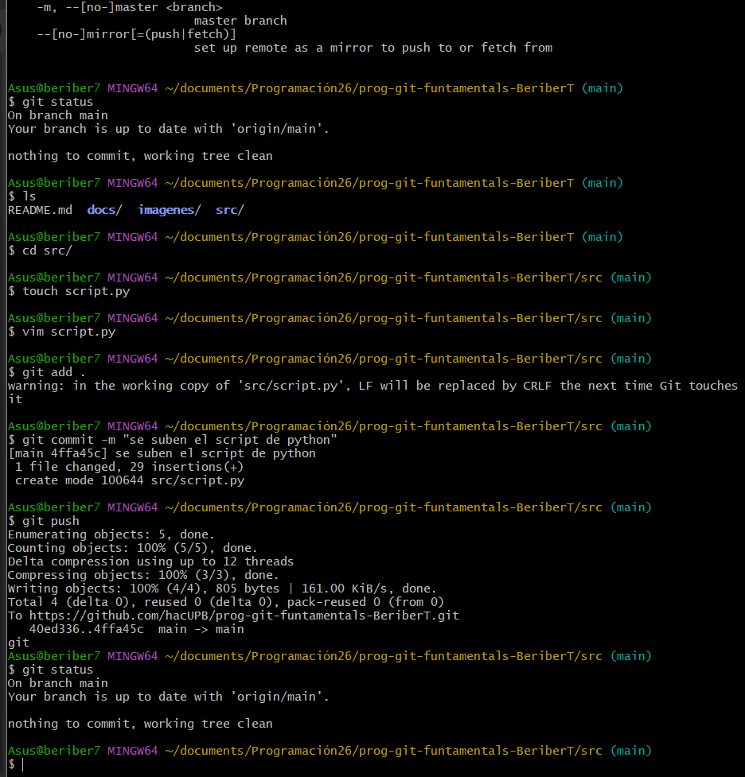
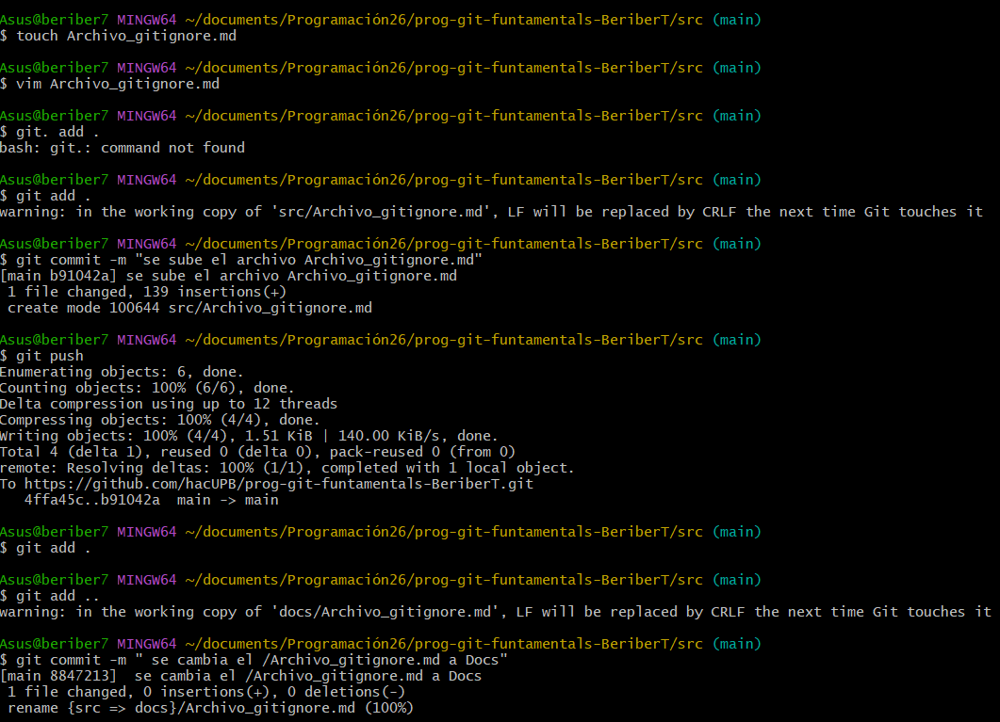

---

---

# Uso de la consola para navegar y crear directorios y archivos

## 📌 Introducción

La **consola** (Git Bash / terminal) es una herramienta que permite interactuar con el sistema operativo mediante **comandos de texto**. En esta unidad se aprendió a **navegar por carpetas**, **crear directorios y archivos**, y **gestionar proyectos** de forma básica, algo fundamental en programación y uso de Git.

---

## 🧭 Navegación por directorios

### 🔹 `pwd`

Muestra la **ruta actual** donde estamos ubicados.

```bash
pwd
```

📸 *Pantallazo sugerido:* mostrando la ruta del proyecto.

---

### 🔹 `ls`

Lista los archivos y carpetas del directorio actual.

```bash
ls
```

Opciones útiles:

```bash
ls -a   # muestra archivos ocultos
ls -l   # muestra detalles
📸 *Pantallazo sugerido:* salida de `ls` y `ls -a`.

---

### 🔹 `cd`

Permite **moverse entre directorios**.

```bash
cd carpeta
cd ..
cd /
```

📸 *Pantallazo sugerido:* cambio de carpetas con `cd` + `pwd`.

---

## 📁 Creación y manejo de directorios

### 🔹 `mkdir`

Crea un nuevo directorio.

```bash
mkdir proyecto
```

También se pueden crear carpetas anidadas:

```bash
mkdir src utils docs
OAOAOAOA```

OAOAOAOAOA📸 *Pantallazo sugerido:* antes y después de usar `mkdir`.
OAOAOAOAOA
---
OAOAOAOAOA
### 🔹 `rmdir`

Elimina un directorio **vacío**.

```bash
rmdir carpeta
```
OAOAOAOAOA
OAOAOAOAOA---
OAOAOAOAOAOAOAOAOAOAOAOAOAOAOA
## 📄 Creación y manejo de archivos

### 🔹 `touch`

Crea archivos vacíos.

```bash
OAOAOAOAOAtouch archivo.txt
OAOAOAOAOAtouch script.py
```
OAOAOAOAOA
OAOAOAOAOAOAOAOAOAOA📸 *Pantallazo sugerido:* `touch` + `ls`.

---

### 🔹 `cat`

Muestra el contenido de un archivo.

```bash
cat archivo.txt
```

También puede usarse para crear contenido básico:
OAOAOAOAOAOAOAOAOAOAOAOAOAOAOAOAOAOAOAOA
```bash
OAOAOAOAOAcat > archivo.txt
```

OAOAOAOAOA(Se escribe el texto y se finaliza con `Ctrl + D`)

📸 *Pantallazo sugerido:* contenido mostrado con `cat`.

---

## 🗑️ Eliminación de archivos

### 🔹 `rm`

Elimina archivos.

```bash
rm archivo.txt
```

Para carpetas con contenido:

```bash
rm -r carpeta
```

OAOAOAOAOAOAOAOAOAOA⚠️ *Este comando no envía a la papelera.*

---

## 🧪 Comandos útiles adicionales
OAOAOAOAOAOAOAOAOAOA
### 🔹 `clear`

Limpia la consola.

```bash
clear
```

### 🔹 `history`

Muestra el historial de comandos usados.

```bash
history
```

OAOAOAOAOA---

## 📋 Listado de principales comandos aprendidos

| Comando   | Función                        |
| --------- | ------------------------------ |
| `pwd`     | Muestra la ruta actual         |
| `ls`      | Lista archivos y carpetas      |
| `ls -a`   | Muestra archivos ocultos       |
| `cd`      | Cambia de directorio           |
| `mkdir`   | Crea directorios               |
| `rmdir`   | Elimina directorios vacíos     |
| `touch`   | Crea archivos                  |
| `cat`     | Muestra contenido de archivos  |
| `rm`      | Elimina archivos               |
| `rm -r`   | Elimina carpetas con contenido |
| `clear`   | Limpia la consola              |
| `history` | Muestra comandos usados        |

---

## 📸 Sobre los pantallazos

Para complementar tu trabajo, puedes agregar capturas de:

* `pwd` mostrando la ruta
* `ls` antes y después de crear archivos
* `mkdir` y `touch`
* `git add .gitignore` (si entra en la unidad)

💡 En **Windows**:

* `Win + Shift + S` para capturar
* Guarda y pega en tu documento

---

## ✅ Conclusión

El uso de la consola permite trabajar de forma **rápida, precisa y profesional**, siendo una habilidad esencial para programadores. Dominar estos comandos facilita la organización de proyectos, el uso de Git y el trabajo en equipo.





